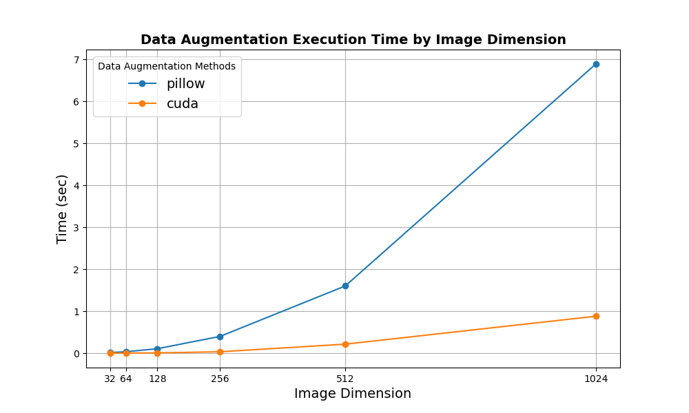
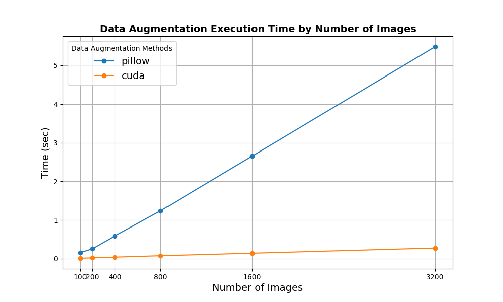

# GPU Accelerated Image Preprocessing & Augmentation with CUDA

## Overview

This project demonstrates how image preprocessing can be made more computationally efficient by leveraging custom CUDA kernels within Python. It showcases a simple Multi-Class Image Classification Network using TensorFlow, applying basic image rotation as an augmentation technique. Additionally, various implementations for image augmentation using Pillow and a custom CUDA kernel are included, with benchmarks highlighting the performance gains achieved through the use of CUDA.

The dataset as well as inspiration for the Multi-Class Image Classification Network came from [Kaggle](https://www.kaggle.com/code/prateek0x/multiclass-image-classification-using-keras).

## Benchmark Results

The data augmentation via Pillow and CUDA is benchmarked based on the following criteria:

- **Dataset size:** The number of images fed to the Neural Network.
- **Image Dimensions:** The image dimensions of the images fed to the network.

*The following plots show the Benchmark results of the Image augmentations applied:*

|  |  |
|:---:|:---:|
| Image Dimension Benchmark | Number of Images Benchmark |

## Installing

### Installation via Conda (Recommended)

To install the project using Conda, follow these steps:

```sh
# Download the latest Miniconda installer
wget https://repo.anaconda.com/miniconda/Miniconda3-latest-Linux-x86_64.sh

# Run the installer
bash Miniconda3-latest-Linux-x86_64.sh -b -u

# Initialize Conda
~/miniconda3/bin/conda init

# Clean up the installer
rm Miniconda3-latest-Linux-x86_64.sh

conda env create -f tfcuda.yml
conda activate tfcuda
```

Installing via pip (alternative):

```sh
pip3 install -r requirements.txt
```

## Running the Project

*You have two main options to run the project:* Quickstart via the `run.sh` script or manual execution of individual components.

### Qucikstart using `run.sh`

You can quickly set up, train, and benchmark the project by using the provided `run.sh` script. This will clean the workspace, train the `multiclass_cnn.py` model using different variations, and run benchmarks. Please note that this process may take several minutes, and will generate log files of both the training runs and benchmark results in the `./output/` directory.

To execute the script, run the following command:

```sh
sh run.sh
```

### Manual Execution

### 1. `multiclass_cnn.py`

This script trains the Multi-Class Image Classification Network and applies Data Augmentation based on CLI parameters. It serves as the core training script, allowing you to configure various aspects of the neural network to simplify benchmarking.

#### CLI Arguments

- `--augment`: Specifies the image augmentation method to apply (E.G: `'cuda'` for CUDA-based or `'pillow'` for Pillow-based rotation).
- `--img_dim`: Set the image dimension for training.
- `--num_img`: Set the number of training images. The dataset is relatively small (240 for training, 60 for validation), so the `tf.Dataloader` will `repeat()` the dataset.
- `--epochs`: Number of epochs for training.
- `--benchmark`: If set, skips training and only runs the benchmark.

#### Example Usage of CLI Arguments

Here are examples of how to use the command-line arguments to train the network or run benchmarks:

```sh
# Train the network without image augmentation
python3 src/multiclass_cnn.py

# Apply Pillow-based image augmentation with images resized to 1024x1024 and train the network for 20 epochs
python3 src/multiclass_cnn.py --augment=pillow --img_dim=512 --epochs=20
```

### 2. `benchmark.py`

The `benchmark.py` script runs performance benchmarks by utilizing the CLI arguments from `multiclass_cnn.py`. This allows you to compare the performance of various image augmentation implementations across different image dimensions and dataset sizes.

```sh
# Run a benchmark using CUDA-based augmentation, with images resized to 1024x1024, and log the results
python3 src/multiclass_cnn.py --benchmark --augment=cuda --img_dim=1024 --num_img=240 >> ./output/benchmark/benchmark_log.log
```

### 3. `src/rotate_kernel.cu`

This file contains the CUDA implementation of the image rotation kernel. The kernel can be executed directly from within the `multiclass_cnn.py` script using PyCUDA.

## Directory Structure
  
- **[`data/`](./data/)**: Contains the dataset, already split in 240 train and 60 test images.
- **[`src/`](./src/)**: Hierarchical source code for the project.
- **[`README.md`](./README.md)**: Documentation outlining project usage and setup.
- **[`Makefile`](./Makefile)**: Automating the build process.
- **[`run.sh`](./run.sh)**: Optional script for executing compiled code.
- **[`tfcuda.yml`](./tfcuda.yml)**: Environement file for installing via conda.
- **[`requirements.txt`](./requirements.txt)**: Requirements file for installation via pip.

**Context:** This project was developed as part of the CUDA Advanced Libraries course offered by Johns Hopkins University.

**Note:** This project is intended to run within the Coursera Lab environment, which comes with a pre-configured CUDA setup.

## Future Work and Optimizations

This project demonstrates that even for simple tasks like image rotation, CUDA kernels can significantly improve performance. As more complex tasks are introduced—especially in image preprocessing and augmentation pipelines—further optimizations and performance gains can be achieved. Leveraging GPU acceleration for more intensive operations will allow for faster model training and deployment in real-world applications.